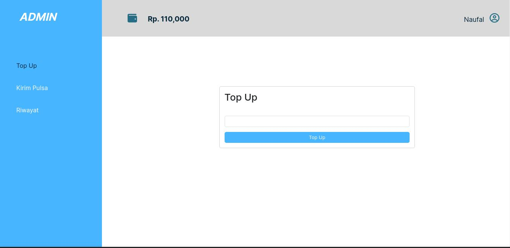
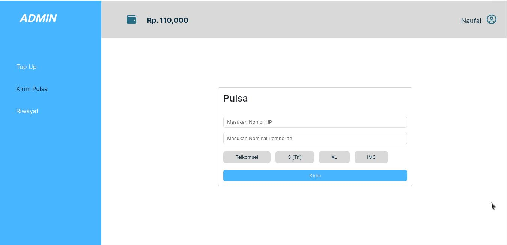
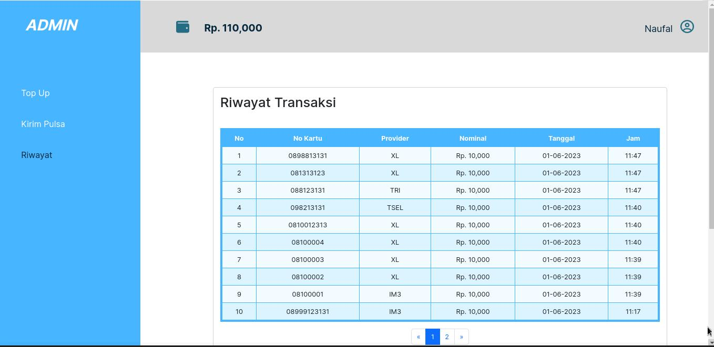

## Tugas Kelompok 2 Study Case (Web Pulsa)

 

# Anggota :

    - Naufal Hadi Putra
    - Taufik Hidayat
    - Muhammad Apriyanto

 

# Tools :

    - HTML & CSS
    - PHP & Javascript
    - Database MySQL
    - PHPMyAdmin
    - XAMPP
    - Boostrap 5
    - Fontawesome
    - Font Inter
    - JQuery
    - Toastr (Notifikasi)

 

## 1. Halaman Top Up

 

 

## 2. Halaman Beli Pulsa

 

 

## 3. Halaman Riwayat Transaksi Pulsa

 

